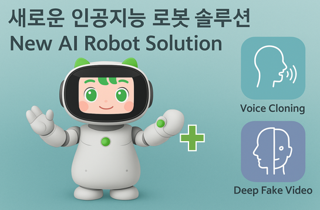
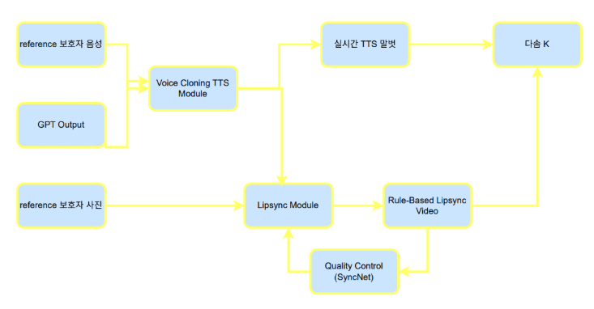

# 치매 돌봄 로봇의 사용자 친밀도를 위한 AI companion

 

## 🔍 프로젝트 소개
- 프로젝트 개요 (한두 문장)
- 주요 기술 요소 요약 (Voice Cloning, Deep Fake Video 등)
- 활용 목적 및 대상 (예: 치매 노인을 위한 인터랙티브 로봇 등)

## 🧠 전체 아키텍처

 

- 각 모듈 간 관계 설명
  - Voice Cloning TTS Module
  - Lipsync Module
  - Rule-Based Lipsync Video
  - Quality Control
  - 최종 출력: 다솜K 로봇 연동

## 🗂️ 레포지토리 구성

- [`/tts`]([https://github.com/sogang-capzzang/tts](https://github.com/sogang-capzzang/CosyVoice)): Voice Cloning TTS 모델

## 👥 역할 분담

| 이름       | 역할 |
|------------|------|
| **김민준 (팀장)** | 프로젝트 총괄, TTS 최적화 및 Backend 구현, 보고서, 발표자료 작성 및 행정 업무 |
| **고운**         | Android application 개발, 보고서, 발표자료 작성, vast.ai 관리 |
| **이경연**       | TTS 개발 및 최적화, GitHub/WIKI/회의록 관리 |
| **김우영**       | Deep Fake Video (Lip Sync) 메인 개발, 논문 작성 및 포스터 제작 |
| **최호진**       | Deep Fake Video (Motion) 메인 개발, 논문 작성 및 포스터 제작 |
